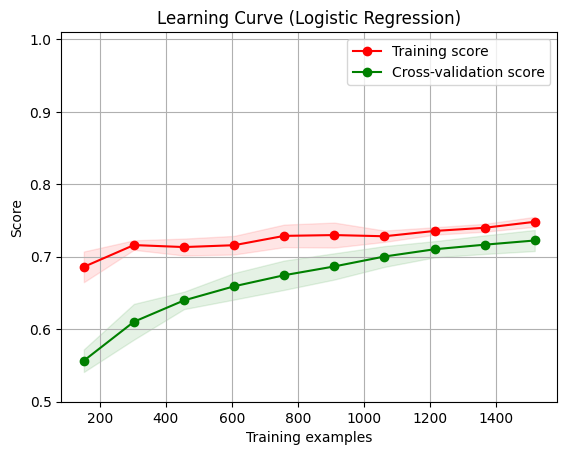
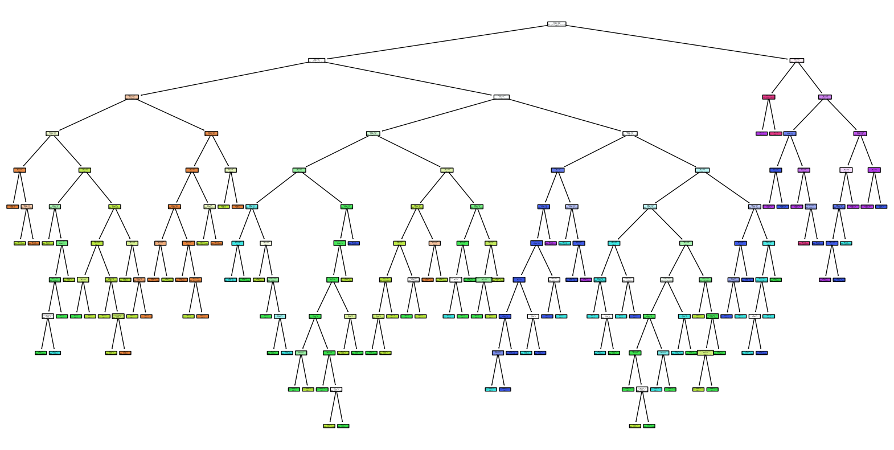
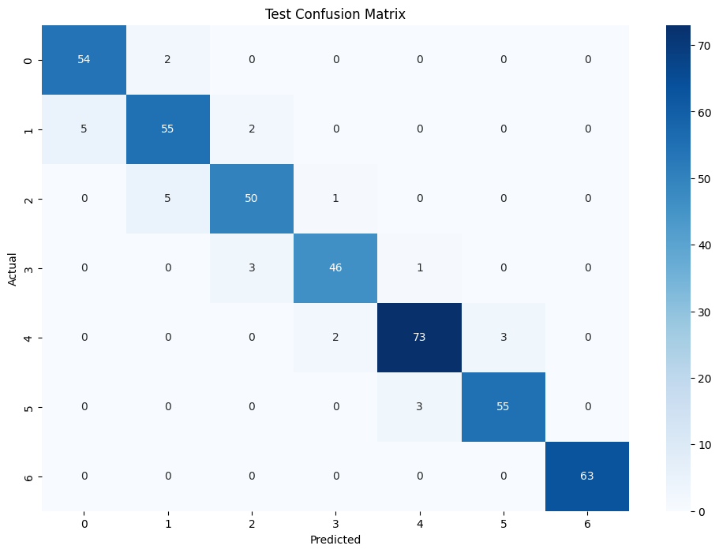

# CSE151A-group-project
## Group Members
Frank Li, til027@ucsd.edu  
Po-Cheng Lai, p1lai@ucsd.edu  
Yixuan Li, yil177@ucsd.edu  
Zhaogu Sun, zhsun@ucsd.edu  

## Milestones
[Milestone 2 Jupyter Notebook](codes/Group_Project_MileStone_2.ipynb)  
[Milestone 3 Jupyter Notebook](codes/Group_Project_MileStone_3.ipynb)  
[Milestone 4 Jupyter Notebook](codes/Group_Project_MileStone_4.ipynb)  
[Written Report docx](source/written_report.docx)  
[Written Report pdf](source/written_report.pdf)  

## Data Description
Estimation of Obesity Levels Based On Eating Habits and Physical Condition. (2019). UCI Machine Learning Repository. https://doi.org/10.24432/C5H31Z.  
There are 2111 instances with 16 features. There are no missing values. 
|Variable Name                 |Role    |Type         |Description                    |
|------------------------------|--------|-------------|-------------------------------|
|Gender                        |Feature |Catagorical  |                               |
|Age                           |Feature |Continuous   |                               |
|Height                        |Feature |Continuous   |                               |
|Weight                        |Feature |Continuous   |                               |
|family_history_with_overweight|Feature |Binary       |Has a family member suffered or suffers from overweight?|
|FAVC|Feature |Binary       |Do you eat high caloric food frequently?|
|FCVC|Feature |Integer      |Do you usually eat vegetables in your meals?	|
|NCP |Feature |Continuous   |How many main meals do you have daily?|
|CAEC|Feature |Categorical  |Do you eat any food between meals?|
|SMOKE|Feature |Binary       |Do you smoke?|
|CH2O|Feature |Continuous   |How much water do you drink daily?|
|SCC|Feature |Binary       |Do you monitor the calories you eat daily?|
|FAF|Feature |Continuous     |How often do you have physical activity?|
|TUE|Feature |Integer     |How much time do you use technological devices such as cell phone, videogames, television, computer and others?|
|CALC|Feature |Categorical   |How often do you drink alcohol?|
|MTRANS|Feature |Categorical |Which transportation do you usually use?|
|NObeyesdad|Target |Categorical|Obesity level|  

## Preprocessing Methods
First, we checked the statistical values, including mean and std.  
Then, we encoded non-numerical features into numerical values. 
We also did some feature expansions on the categorical data which converted each level into separate columns and encoded them using binary.
Finally, we picked up some features and drew some graphs to see the correlations between features.  

## First Model
### Evaluation
We normalized and standardized the data.  
We wanted to do a classification, predicting the obesity level of a person based on their physical conditions and lifestyles. Therefore, the first model we tried was the logistic regression. We split the data into train and test sets with a ratio of 9:1 and trained the model.  
The training accuracy is 0.759 and the testing accuracy is 0.717. It indicates that our model is still underfitting. And our model is not accurate enough.  
  
### Conclusion
In our first model, we used logistic regression, and the accuracy we got was not as ideal as we expected, but we successfully predicted around 70% of our testing and training data. We want to find a better way to deal with our categorical data since our categorical data have multiple levels that cannot just be represented by binary.  
### Next Model
Since the accuracy of our model is not as ideal as expected, we are thinking of using neural network as our next machine learning model. The reason why we want to choose neural network is that the perceptrons can perform non-linear transformations. By doing so, we can increase the complexity of our model which may help us improve our accuracy.  

## Second Model
### Method
A decision tree classifier was chosen as the second model. The data was split into training and test sets with an 80-20 split. The decision tree model was trained using the standardized dataset. We set the random state to 42 for reproducibility. The model's performance was evaluated using accuracy scores, and confusion matrices were generated to understand the classification results in detail. Additionally, hyperparameter tuning was performed using GridSearchCV to optimize the model. The parameters tuned included criterion (gini, entropy), max_depth (None, 10, 20, 30, 40, 50), min_samples_split (2, 5, 10), min_samples_leaf (1, 2, 4), and max_features (None, sqrt, log2). The best parameters and the best score obtained from grid search were recorded.  
### Result
The decision tree classifier, trained on the standardized dataset, performed exceptionally well, achieving a training accuracy of 100% and a test accuracy of 93.62%.  
  
The confusion matrix for the test set demonstrated that the model accurately classified most of the obesity levels, with very few misclassifications.  
  
### Potentials
The decision tree could capture the non-linear relationships much better, which was reflected in its higher accuracy—100% on training and 93.62% on testing. The high training accuracy was a bit concerning since it hinted at overfitting. To further improve our model, we may prune ithe dicision tree, deleting some nodes, to match general cases.  

## Conclusion
Reflecting on our project, we made strides in understanding and predicting obesity levels based on eating habits and physical conditions. Our journey began with thorough data exploration, followed by employed logistic regression and decision tree models, each offering unique insights and presenting distinct challenges. While logistic regression provided a solid baseline, it struggled with the complexity of our data. The decision tree model performed admirably, but its tendency to overfit reminded us of the need for careful model tuning and validation.  

In hindsight, there are a few things we can be improved on. Firstly, incorporating a wider variety of model might be provided a more robust understanding of the data. These models often balance bias and variance better than single models. Additionally, exploring deep learning techniques could have uncovered more intricate patterns and interactions within our dataset. Enhancing our feature engineering process, possibly by including more domain-specific knowledge, might have also improved model performance.  

Looking ahead, future directions could include developing a more integrated approach that combines multiple models to leverage their strengths. For instance, exploring advanced preprocessing techniques and dimensionality reduction methods, such as PCA, might refine our feature set. 

## Collaboration
Frank Li: discussing high level ideas, data preprocessing, complementing the written report, organizing the github repository. 

Po-cheng Lai: discussing high level ideas, data preprocessing, complementing the written report. 

Yixuan Li: discussing high level ideas, data preprocessing, training the first model, complementing the written report. 

Zhaogu Sun: discussing high level ideas, data preprocessing, training the second model, complementing the written report. 
